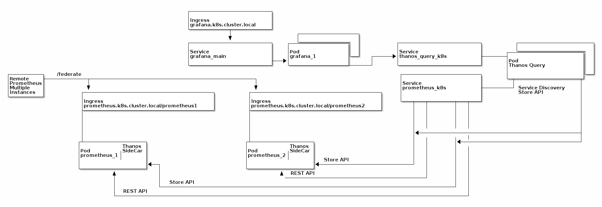

# Thanos flavoured Prometheus Operator


## Description

This repository builds up a Setup for the [prometheus-operator](https://github.com/coreos/prometheus-operator) in an HA configuration for local K8s monitoring.
It ensures that prometheus is running and configured as desired for Deduplication with the Thanos Query.

The base configurations comes from the repository [kube-prometheus](https://github.com/coreos/kube-prometheus). Adding new dashboards for grafana and rules for prometheus is possible via files in the chart.

## How to build the jsonnet stuff

Install jsonnet or go-jsonnet and the jsonnet bundler.

```Dockerfile
FROM golang:buster

RUN go get github.com/jsonnet-bundler/jsonnet-bundler/cmd/jb
RUN go get github.com/brancz/gojsontoyaml
RUN go get github.com/google/go-jsonnet/cmd/jsonnet
RUN mkdir -p /project/manifests
COPY . /project
RUN jb install

VOLUME /project/manifests

CMD ["bash" "build.sh"]

```

## Architecture



## The helm chart stuff

### Known Bugs

If you are using a different release-name than `thanos-prometheus-operator` or
if you are using a different namespace than `monitoring-system` you need to set the following
effectively.

```yaml
querier:
  query:
    dnsDiscovery:
      sidecarsService: {{ <release_name>-prometheus-thanos | default "thanos-prometheus-operator-prometheus-thanos" }}
      sidecarsNamespace: {{ <namespace> | default "monitoring-system" }}
```

### Dependencies

```yaml
dependencies:
  - name: thanos
    version: 0.1.5
    repository:  https://charts.bitnami.com/bitnami
    condition: query.enabled
    enabled: true
    alias: query
  - name: grafana
    version: 1.2.8
    repository: https://charts.bitnami.com/bitnami
    condition: grafana.enabled
  - name: prometheus-operator
    version: 0.13.1
    repository: https://charts.bitnami.com/bitnami
    condition: prometheus-operator.enabled
    alias: prometheus-operator
```

### Additional Configuration beside the available configuation from the dependencies

```yaml
federation:
  enabled: true|false     # enabled ingress federation support for prometheus
  ingress:          # this only takes effect in the `produce` type
    baseFQDN: k8s.cluster.local                                       # gets extended with prefix prometheus-(0-N) for every replica in .
    annotations:
      nginx.ingress.kubernetes.io/auth-realm: Authentication Required
      nginx.ingress.kubernetes.io/auth-secret: basic-auth             # this needs to be created by hand.
      nginx.ingress.kubernetes.io/auth-type: basic
    servicePort: http
    tls: no

dashboards:
  enabled: true                                                       # handles the templating of the dashboard ConfigMaps.

prometheus-operator:
  enabled: true|false
  prometheus:
    enabled: true|false
    # this should be set if federation is enabled. To decide properly on the different instances.
    externalLabels:
      customer: "<customer>"
      cluster: "<cluster>"
    # this should be added if federation is disabled. To scrape on the other federated prometheus instances.
    additionalScrapeConfigsExternal: true

query:
  enabled: true|false

grafana:
  enabled: true|false

```

### Afterwards configuration

#### basic-auth

* This is needed if you set `federation.enabled: true`
* Example Secret for the `basic-auth.yaml` federation basic-auth
* It cannot be handled by the helm chart.

```yaml
# the auth file was generated with the following command:
# htpasswd -cb auth <username> <password>
# this file was generated with the following command:
# $ kubectl create secret generic basic-auth --from-file=auth --dry-run -oyaml > basic-auth.yaml
apiVersion: v1
data:
  auth: ""
kind: Secret
metadata:
  creationTimestamp: null
  name: basic-auth

# TODO: AutoGenerate this stuff for every federated instance.
```

#### Additional Scrape Configuration

```yaml
# additional-scrape-config.yaml
- job_name: 'prometheus-<customer>'
  scheme: https
  scrape_interval: 15s
  honor_labels: true
  metrics_path: /federate
  basic_auth:
    username: <username>
    password: <password>
  params:
    'match[]':
      - '{job=~"^(kubelet|thanos-prometheus-operator-.*?|apiserver|kubelet|node-exporter)$"}'
  tls_config:
    insecure_skip_verify: true
  static_configs:
  - targets:
    - 'prometheus-0.<baseFQDN>'
    - 'prometheus-1.<baseFQDN>'
```

* This is only needed for the control-plane or the core prometheus instance if you don't have services
  outside of K8s
* Example Secret for the `additional-scrape-config.yaml`

```yaml
# this file was generated with the following command:
# $ kubectl create secret generic additional-scrape-configs --from-file=prometheus-additional.yaml --dry-run -oyaml > additional-scrape-configs.yaml
apiVersion: v1
data:
  additional-scrape-configs.yaml: ""
kind: Secret
metadata:
  creationTimestamp: null
  name: thanos-prometheus-operator-prometheus-scrape-config

# TODO: AutoGenerate this stuff for every federated instance.
```

##### prometheus diffs between tenant and controlplane

```diff
123c123,124
<         environment: "production"
---
>         customer: "<customer>"
>         cluster: "<cluster>"
224c225
<       additionalScrapeConfigsExternal: true
---
>       additionalScrapeConfigsExternal: false
```
